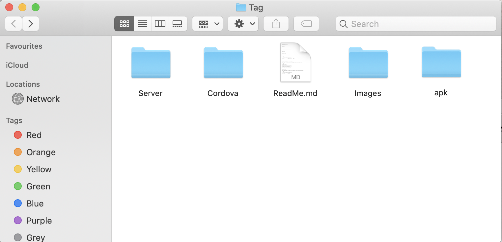
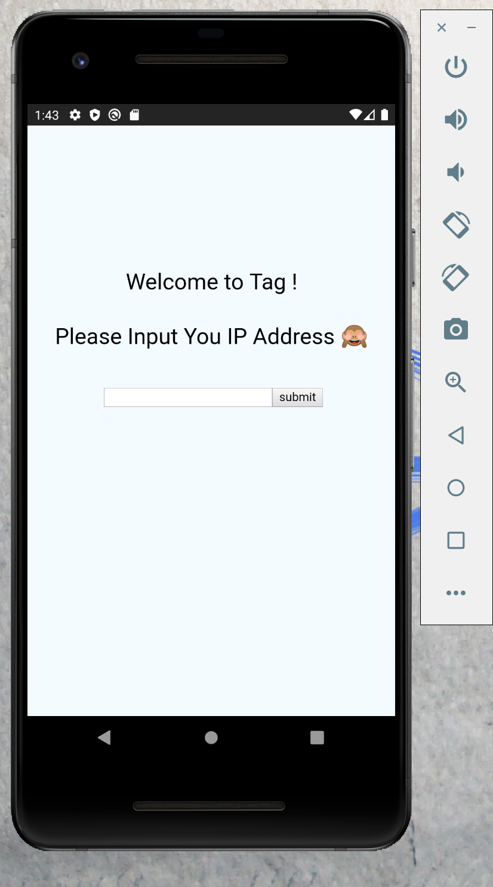
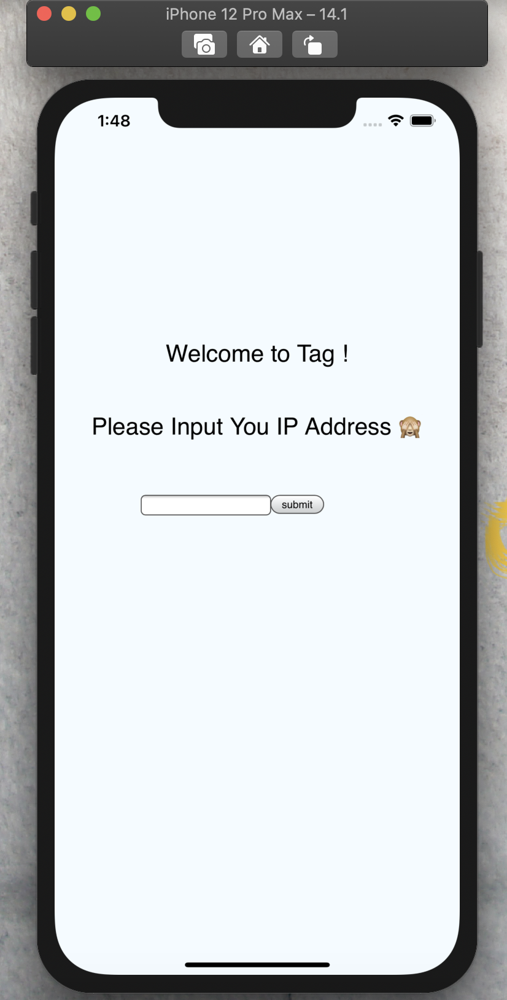
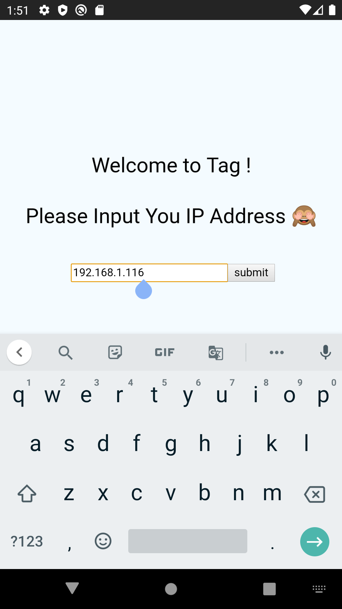
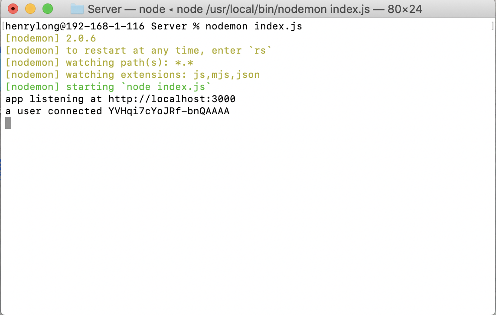
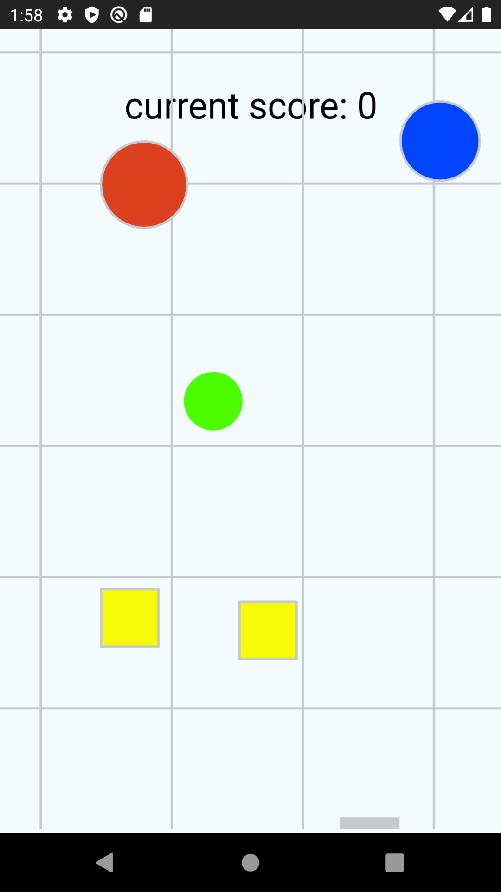
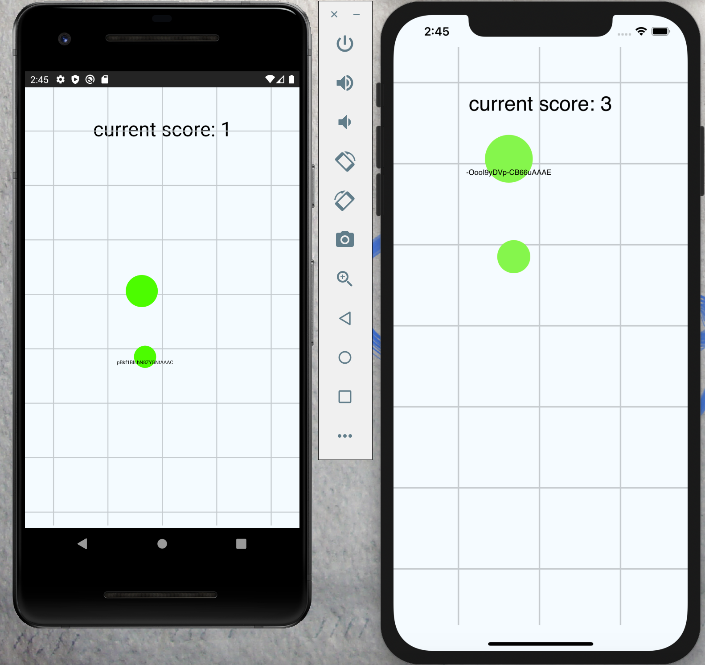
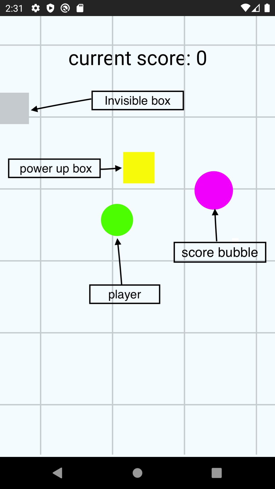
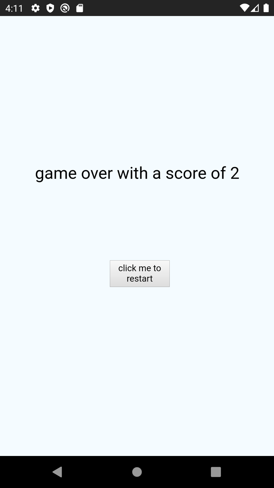

# Game Tag Read Me


## Set Up


Before running the App, please make sure you have already installed `node.js` and `Cordova`

[node.js](https://nodejs.org/en/)

[Cordova](https://cordova.apache.org/)


## Start Game





### Start Server


1. Please download the **Tag** folder, and navigate into the **server** folder 


```bash
 % cd /Users/henrylong/Desktop/Tag/Server 
 
Server % ls
index.js		package-lock.json	public
node_modules		package.json
```


2. Run the Server

   ​		1.  ` nodemon index.js `  (run `sudo npm install -g nodemon` to install it first)

   ​	    or  2. `node index.js`


When it shows `app listening at http://localhost:3000`,  this means server successfully running

```bash

% nodemon index.js 
[nodemon] 2.0.6
[nodemon] to restart at any time, enter `rs`
[nodemon] watching path(s): *.*
[nodemon] watching extensions: js,mjs,json
[nodemon] starting `node index.js`
app listening at http://localhost:3000

```


### Start Cordova 

Open another terminal, and navigate into the **tag** folder, which is inside the Cordova folder

```bash

 cd /Users/henrylong/Desktop/Tag/Cordova/tag 
% ls
config.xml		package.json		www
node_modules		platforms
package-lock.json	plugins


```


Make sure you are in the **tag** folder

* for Android emulatator, run:
  1. `cordova build android`
  2. `cordova emulate android`

After successfully running:

The android emulator will be showing on your screen, and you will be in the welcome interface of the **tag**





* for IOS emulatator, run:
  1. `cordova build ios`
  2. `cordova emulate ios`

The android emulator will be showing on your screen, and you will be in the welcome interface of the **tag**




### Entering the Game

**Please make sure your local server is accessible from external devices! **


Input your IP address in the input box, then click `submit`





**If your device successfully connect the server, the server side termial will be showing:  `a user connected + your socket id` .**

if nothing showing on the server side terminal , please make sure the **correct IP address** is inputed and your local server is accessible from external devices.




Now you are successfully entering the game and you can wait for another user:




## Play Game


### How to Play ?

When you are in the game, you need to control the **Green bubble in the middle**, whenever you click the screen, it will move following the curson direction. 

There could be Mutiple players in the game,  what you need to do is to **catch the player who is smaller than you, and stay away from player who is a larger than you !**, if you are not sure the other is smaller or larget than you, **stay away from them for now !**


As you can see in the follwing screenshot, the one on the top would be the  catcher, the other one need to stay away from him/her as soom as possible for now.


**For the testing purpose, I keep the player's id on the bubble, I will remove it in the future formal version :) **





### Three Tools in the game

There are three tools in the game which are: 

1. Score bubble 
   * a cricle with a color (the color might be red, yellow, blue... or even **Green! Same as player's color, I did it on purpose :) ** 
   * When you collect a score bubble, your radius will because larger than before
   * your curren score will add 1 point !
2. power up box
   * **a rectanglar with the yellow color**
   * when you collect a power up box, yuo will be **moving faster** than normal
   * the speedy effect only lasts for **ten seconds**, and during this perid, you cannot collect other power box (no extra effect or time extension)
3. Invisible box
   * **a rectanglar with the grey color**
   * when you collect a power up box, yuo will become **invisible!**
   * the invisible effect only lasts for **ten seconds**, and during this perid, you cannot collect other invisible box (no extra effect or time extension)





### Game over

When you are catched by other players, game will over and your final score will be listed on the screen, if you want t ostart again, click the `click me to restart`





## APK for Android Devices


There is a `app-debug.apk` in the apk folder, you will download the apk to install the game in your Android devices. Once successful installed, the process of running it is similiar to the android emulator section. **(Plase make sure your Android devices and your server are in the same Network!)**


## Running the desktop version

After openning the server,  go to `http://localhost:3000/`

Input the IP address and start the game!


**Enjoy the game !** 

**please feel free to make any commets or give feedback**

**Contact me through henrylong719@gmail.com**

**I will keep improving it  :)**